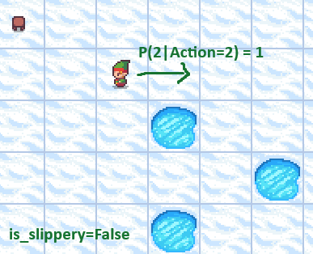
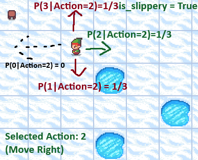

# Utilizing Q-Learning in Gymnasium: Step by Step

## Brief Gymnasium Overview
[Gymnasium](https://gymnasium.farama.org/) is a useful Python library based on [OpenAI's Gym library](https://github.com/openai/gym?tab=readme-ov-file). This library provides a variety of environments for training and testing reinforcement learning algorithms. You control an agent by choosing from different actions, influencing what state the agent ends up in next. Each environment in Gymnasium provides a non-zero reward (negative or positive) after each step and/or upon reaching the desired end goal. These rewards help reinforcement learning algorithms determine the effectiveness of actions taken in a given state, allowing adjustments in future episodes to determine the best possible action for each state. The environments offer various options that can increase the complexity of finding optimal solutions.

## The Frozen Lake Environment
For the purpose of testing Q-Learning in a relatively simple environment, I will be utilizing the [Frozen Lake](https://gymnasium.farama.org/environments/toy_text/frozen_lake/) environment. The goal of Frozen Lake is to cross a frozen lake from the starting point to the goal without falling into any holes. Frozen Lake comes in both a 4x4 and 8x8 environment, for this guide I will be using the 8x8 environment to make the challenge slightly more complex, and gather more insights in the process.


### Understanding and Traversing the Environment
||||
|------------|---------|------------|
|Action Space|Discrete(4)|0: Move left, 1: Move down, 2: Move right, 3: Move up|
|Observation Space|Discrete(64)|0-63 (Position calculation: current_row *ncols + current_col)


</br>
In the above image we can see that the observation space is represented as integers from 0-63 where 0 is the starting position (top left) and 63 is the goal position (bottom right). You can calculate a position as the `current_row * ncols + current_col`. As mentioned in the table, the agent can take 1 of 4 actions:
- 0: Move left
- 1: Move down
- 2: Move right
- 3: Move up
  
In this example, taking action 1 (move down) moves the agent to position 17 (unless `is_slippery` is enabled, while is explained below).


#### is_slippery
When creating the environment, `is_slippery` can be set to True or False. If disabled, you will always move in your intended direction. If enabled, you will only move in your intended direction 1/3 of the time, otherwise, you have an equal 1/3 chance of slipping in either perpendicular direction. For example:
</br>
is_slippery=False             |  is_slippery=True
:-------------------------:|:-------------------------:
  |  

When taking action 2 (go right), the `is_slippery` setting determines movement probabilities. If disabled, you always move right. If enabled, you move right with only a 1/3 probability, and there's an equal chance of moving in either perpendicular direction. In this case you could go up or down as well. 
<br/><br/>
**Enabling is_slippery increases complexity. Instead of simply finding the shortest path to the goal, you must now find the path that maximizes your chances of reaching the goal without falling into a hole.** In some other environments, a shorter but riskier path might be preferable, if longer paths incur negative rewards / penalties. However, as we'll see, Frozen Lake uses a simple reward structure.

#### Rewards and Endings
The rewards structure for Frozen Lake is very simple. You are only rewarded for eventually reaching the goal. There is no penalty for taking too many actions, except for a time limit.

|Reached|Reward|
|---------|-----------|
|Goal|+1|
|Hole|0|
|Frozen|0|

**Possible Endings:**
- Goal Reached
- Player moves into a hole
- Length of episode (actions taken) reach 200 (100 if using 4x4 environment)

While there is technically no negative reward, reaching the episode limit or falling into a hole is undesirable as we will not get a reward for that episode, and we will be unable to tell if the actions we took in that episode were in the "right direction" up to a certain point as we receive no positive feedback for partial progress.

## Setup
### Libraries / Imports
We will need a few libraries in order to:
- Use Gymnasium
- Debug / Monitor Performance of our Q-Learning Algorithm

These can be imported as:
```python
import gymnasium as gym
import numpy as np
import time
import math
from matplotlib import pyplot as plt
```
### Initializing the Environment
The Frozen Lake environment can be initialized with the `gym.make('FrozenLake-v1')` command. There are various arguments that can be used to customize the environment.

#### map_name
The `map_name` argument allows us to specify the map size, either `4x4` or `8x8`. In our examples, we will be using 8x8.
```python
gym.make('FrozenLake-v1', map_name="8x8")
```

gym.make('FrozenLake-v1', map_name="8x8")|gym.make('FrozenLake-v1', map_name="4x4")
:-------------------------:|:-------------------------:
  |  

#### desc
The `desc` argument can be used to customize the map.
|Letter|Tile|
|---------|-----------|
|S|Start tile|
|G|Goal tile|
|F|Frozen tile|
|H|Tile With a Hole|

The `desc` argument is written in the following format (for 4x4): `desc=["SFFF", "FHFH", "FFFH", "HFFG"]`.

For example, `env = gym.make("FrozenLake-v1", map_name="4x4", render_mode="human", desc=["SHHH", "HHHH", "GGGG", "FFFF"])` will create the following environment:
</br>

</br>
Additionally, the generate_random_map function can be imported and used to generate a random map of any size.
```python
from gymnasium.envs.toy_text.frozen_lake import generate_random_map
env = gym.make("FrozenLake-v1", desc=generate_random_map(size=12), render_mode="human")
```
The above code generated this 12x12 environment:
<br/>


#### render_mode
To help visualize what is going on the environment, there are various render options. By default, `render_mode` is set to None as it would not make sense to visually print tens of thousands, or even millions of episodes.

|render_mode|Description|
|---------|-----------|
|None|No render is computed **(Default)**|
|human|Continuous rendering in the current display / terminal. The images shown earlier in this guide are all from the human render_mode.|
|rgb_array|Not used in this guide, more info: https://gymnasium.farama.org/api/env/#gymnasium.Env.render|
|ansi|Not used in this guide, more info: https://gymnasium.farama.org/api/env/#gymnasium.Env.render|
|rgb_array_list|Not used in this guide, more info: https://gymnasium.farama.org/api/env/#gymnasium.Env.render|

**For now, we will create a function `run_episodes` to allow us to run a specified number of episodes in an environment, gather the results, and specify variables in our Q-Learning algorithm.**

```python
def run_episodes(episodes, learning_rate=0.05, discount_factor=0.95, epsilon=1, epsilon_change=0.01, slippery=True, render=None):
    env = gym.make("FrozenLake-v1", map_name="8x8", is_slippery=slippery, render_mode=render)
```

I have set some default values for a lot of these parameters, however, optimal values for these can vary based on map size, episode count, the `is_slippery` setting, and any other environment changes. `learning_rate`, `discount_factor`, `epsilon`, and `epsilon_change` will be explained further down in the guide (as it relates more to the Q-Learning calculation that will be used). The other parameters do the following:

|Parameter|Description|
|---------|-----------|
|episodes|Episode count (ex. 500 episodes would mean that the "game" is played 500 times until we reach one of the end conditions for each episode)|
|slippery|`True` or `False`, enables or disables `is_slippery` option in the environment|
|render|One of the above render_mode options can be specified here. `'human'` is useful, however, it should not be used for a large episode count as it significantly increases runtime|


## Keeping Track of Results
We will create some NumPy arrays to help track results so we can see the effectiveness of our implementation.
```python
    # 64 states (0 to 63) and 4 actions (0 = left, 1 = down, 2 = right, 3 = up)
    q = np.zeros((env.observation_space.n, env.action_space.n)) # q-value storage
    rng = np.random.default_rng() # random number from 0 to 1 (to determine if random action should be taken)
    completions = np.full(episodes,False)
    ep_lengths = np.zeros(episodes)
    ep_epsilons = np.zeros(episodes)
    checkpoints = math.floor(episodes/10) # Print statement at 10% completion intervals
```

|Variable|Used For|
|----------|--------------------------|
|q|Used for q-value storage, this starts off as an array of 0's of size 64x4. This allows us to store a Q-Value for every combination of position and action.|
|rng|Generator used to choose a number between 0 and 1. If the random number generated is lower than our `epsilon` value, we will take a random action. Otherwise, we will take the best action as determined by our Q-Values.
|completions|An array with an entry for each episode we run, it starts off as `False`. If we reach the goal in an episode, the value at the index for the current episode will be changed to `True`.|
|ep_lengths|An array with an entry for each episode we run, it starts off with 0 values, when an episode completes, we will update the value at the index for the current episode with the amount of actions taken that episode.|
|ep_epsilons|We will be using a decaying epsilon value (to be discussed later in the guide). This array has an entry for each episode, which will be updated with the epsilon value for each individual episode.|
|checkpoints|Just for tracking the progress of running episodes. This calculates how many episodes it takes to reach 10% of episodes completed. We will print out some basic statistics at each 10% checkpoint.|

## Running Episodes and Q-Learning Implementation

Let's look at the code for running each episode, choosing an action, and updating our q-values/results.

```python
 for _ in range(episodes):
        state, info = env.reset()
        
        if (_+1)%checkpoints==0:
            print("Ep", _, " , Epsi:", round(epsilon,3), " | Comp:", completions.sum(), " | Success Rate:", round(completions.sum()/_,3)*100,"%")
          

        while True:

            if rng.random() < epsilon:
                action = env.action_space.sample() # Random action
            else:
                action = np.argmax(q[state,:])

            # new_state: After taking the action calculated above, what position are we now in? (0-63)
            # reward: The reward for taking that action (reach goal = +1, reach hole/frozen = 0)
            # terminated: True if the player moves into a hole OR the player reaches the goal
            # truncation: True if the limit (length of episode) is reached, this is 200 for 8x8 env
            # info: number from 0 to 1 with odds of taking the action requested (1/3 if is_slippery, 1 otherwise)
            new_state, reward, terminated, truncated, info = env.step(action)

            if reward == 1:
                completions[_] = True

            q[state,action] = q[state,action] + learning_rate * (reward + discount_factor * max(q[new_state,:]) -q[state,action])

            state = new_state
            ep_lengths[_] += 1

            if terminated or truncated:
                break

        ep_epsilons[_] = epsilon
        epsilon -= epsilon_change # Lower Epsilon by specified amount
        if epsilon < 0:
            epsilon = 0
```

Let's break it down step by step:

### Monitoring Current Progress

```python
    for _ in range(episodes):
        state, info = env.reset()
```

In the above code section we run a for loop for the specified number of episodes. We start each iteration with an environment reset. `env.reset()` will return the starting state (`state`) and debug info (`info`).

The values returned by the reset function are as follows:
|Variable|Returned Value|
|---------|-----------|
|state|`0` (this is the starting position)|
|info|`{'prob': 1}` (since you always start in position 0)|

```python
    if (_+1)%checkpoints==0:
            print("Ep", _, " , Epsi:", round(epsilon,3), " | Comp:", completions.sum(), " | Success Rate:", round(completions.sum()/_,3)*100,"%")
```

The **above code section is optional**. It is used to print out some of the more important statistics at every 10% checkpoint (ex. if there are 1,000 episodes: this will be printed out every 100 episodes)

Example output: `Episode 1999  , Epsilon: 0.78  | Completions so Far: 40  | Success Rate so Far: 2.0 %`
<br/>
This output tells us that as of the 2,000th episode (count starts at 0), the epsilon value is 0.78, 40 of the 2,000 episodes (2.0%) have resulted in reaching the goal.

### Epsilon and Exploration

```python
    while True:

            if rng.random() < epsilon:
                action = env.action_space.sample() # Random action
            else:
                action = np.argmax(q[state,:])
```
In the above code block, we will run this loop forever (there is a `break` condition later if we fall into a hole, reach the goal, or reach our action limit).  This is the point where we decide if we are going to choose a random action or what we have currently observed to be the best action. `rng.random()` returns a number between [0.0,1.0). Therefore, if our `epsilon` value is set to 1: we will **always take a random action**, this random action is chosen through the `env.action_space.sample()` function. Likewise, if our `epsilon` value is set to 0: we will **always take an action based on the optimal q-value in our given state**. For example, if we are picking an optimal Q-Value and are currently in state position 15, we will choose to go left, right, up, or down based on which of the 4 actions are highest in index 15 of the state dimension in our `q` array. This is checked via `np.argmax(q[state,:])`.

**It is generally best to start with a very high epsilon (1 since we have no current data to base our choices off of)**. This ensures we initially only choose random actions. Overtime, as our `q` array gets updated, we will make more decisions based off of that.

|$$\epsilon$$|Odds|
|---------|-----------|
|1|Random action is chosen 100% of the time|
|0.75|Random action is chosen 75% of the time, 25% of the time we choose what we currently believe is the optimal action given our current state|
|0.5|Random action is chosen 50% of the time, 50% of the time we choose what we currently believe is the optimal action given our current state|
|0.25|Random action is chosen 25% of the time, 75% of the time we choose what we currently believe is the optimal action given our current state|
|0|We always choose what we believe is the optimal action given our current state **(no exploration)**|

It is important to have a balance when it comes to epsilon values. 

If it is always high, we will never actually use what we have observed before, which will also make it more difficult to find our goal and optimal solution, as it is very unlikely our agent will even be able to make it near the goal if it can not use the information it has gathered along the way to avoid falling into a hole or going in circles.

If the epsilon value is too low, we risk missing out on a potentially better solution, since we will always be going with what we **think** is best. Imagine if you are driving with a GPS that has no real-time traffic, outdated maps, and old speed limits. It may tell you a road is the best for getting to your destination, but what if a new road with less traffic and a higher speed limit has been built since then? If we never explore, we risk missing out on a more optimal path.

### Taking our Action
```python
            new_state, reward, terminated, truncated, info = env.step(action)

            if reward == 1:
                completions[_] = True
```

Using the `env.step()` function, we can pass our intended action chosen previously as an argument. Various variables are returned:

|Variable|Returned Value|
|---------|-----------|
|new_state|an `int` value representing our new position (between 0-63 on the 8x8 environment)|
|reward|a `number` value representing the reward gained from entering our new state (in this case: 1.0 if we reach the goal space, 0.0 otherwise)|
|terminated|`bool` value. `True` if we reach the goal **OR** fall into a hole, `False` otherwise|
|truncated|`bool` value. `True` if the length limit of the episode (200 for 8x8) is reached, `False` otherwise|
|info|The chance of us ending up in the new state, `{'prob': 0.3333333333333333}` if `is_slippery` is enabled, `{'prob': 1}` otherwise.|

**It is important to remember**, if `is_slippery` is enabled, you will not always go in the direction you intended, `new_state` will return the **ACTUAL** position you have ended up in.

We will then also update our `completions` array at the index of the current episode (`_`) to `True` if we found the goal and received a reward.

### Updating our Q-Value

```python
q[state,action] = q[state,action] + learning_rate * (reward + discount_factor * max(q[new_state,:]) -q[state,action])
```

The Q-Learning equation is as follows:
$$Q(s, a) \leftarrow Q(s, a) + \alpha [r + \gamma \max_{a'} Q(s', a') - Q(s, a)]$$

Where
- $Q(s,a)$ is the Q-Value for state `s` and action `a`
- $\alpha$ is the learning rate
- `r` is the immediate reward
- $\gamma$ is the discount factor
- $\max_{a'} Q(s', a')$ is the maximum Q-value of our next state

Going into further detail:

#### Alpha (Learning Rate)

$\alpha$ is our learning rate (and is usually a number between 0 and 1). A larger $\alpha$ means that the Q-Value is updated quicker based on the new information we found. This means faster learning but at the cost of potentially being unstable (value changing too quickly and the Q-Value becoming too high/low based on a single update). Lower values are more stable but will cause new information to impact the Q-Value less potentially leading us to need more episodes.

#### Gamma (Discount Factor)

$\gamma$ is our discount factor. $\gamma$ ranges from 0 to 1 ($0 \leq \gamma \leq 1$). When $\gamma$ is 0, it means that the agent will only consider immediate rewards, meaning if it had the choice of getting 20 dollars today or 10 dollars today plus an additional 10,000 dollars tomorrow, it would choose to get 20 dollars today. It is **important to note that in Frozen Lake, you only receive a reward for reaching the end goal, so having a low gamma would be particularly problematic since you won't receive one the vast majority of the time**. If $\gamma$ is set to 1, future rewards will be valued just as much as the immediate reward received. Any values between 0 to 1 will be a balance, with lower values lowering the importance of future rewards.

#### Q-Values

We store Q-Values to determine what we have currently observed to be the best action to take given the current state (which is influenced by the values chosen for Gamma, Alpha, Epsilon, etc.). They are stored in the following format (for simplicity imagine there are **4 possible positions and 2 possible actions (left, right).**

```
[[0.5 0.21]
 [0.95 0.01]
 [0.51 0.49]
 [0.02 0.83]]
```

In this example, if we are in state 1, we can see that we have found that going left is significantly better (0.95 vs 0.01) than going right. However, if we are in state 2, left is only slightly better (0.51 vs 0.49) than going right. We would still go left in all cases when deciding by Q-Values since we are only basing our decision off of the action with the **max** Q-Value. In this case, having a balanced epsilon value would help us still test the other possible actions (going right) to see if better results occur that way, instead of always going left.

### Finishing the Episode

```python
            state = new_state
            ep_lengths[_] += 1

            if terminated or truncated:
                break
```

Now that we have finished updating our Q-Value, we start by updating our `state` variable to the `new_state` value. Since an action was taken, we will update our tracking metric for episode lengths (`ep_lengths`) by increasing the value for this episode's (`_`) entry by 1.

Finally, if this episode results in us reaching one of the 3 end conditions (goal reached, fell in hole, or episode length limit), we will break out of this loop and start a new episode. Otherwise, we will now go back to the start of the `while True:` loop.

### Finishing All Episodes and Closing the Environment
```python
    time.sleep(0.5)
    env.close()
    
    print("\nSimple Breakdown:")
    print("Episodes:", episodes)
    print("Successful Episodes:", completions.sum())
    print("Failed Episodes:", (episodes-completions.sum()))
    print("Success Rate:", round(((completions.sum())/(episodes))*100,3), "%")
    print("Success Episode Array:", np.convolve(completions, np.ones(100), 'valid'))

    # np.convolve will compute the rolling sum for 100 episodes
```

After finishing the last episode, I have added a short pause (this is mostly for if we are visualizing the environment so the final result can be seen for longer. Afterwards, the environment is closed using `env.close()`, this will also close any rendering windows. Afterwards, some useful statistics are printed in the following format:

```
Simple Breakdown:
Episodes: 20000
Successful Episodes: 9870
Failed Episodes: 10130
Success Rate: 49.35 %
Success Episode Array: [  0.   0.   0. ... 100. 100. 100.]
```

The number of episodes, successful episodes, failed episodes, success rate, and success episode array (the number of successful episodes out of the last 100 episodes (between 0 to 100)).

### Visualizing the Results

```python
    fig, axs = plt.subplots(1, 2, figsize=(20, 8))

    axs[0].plot(np.convolve(completions, np.ones(100), 'valid'))
    axs[0].set_title("Successful Episodes")
    axs[0].set_xlabel("Episode")
    axs[0].set_ylabel("# of Successful Episodes Out of Past 100")

    ax2 = axs[0].twinx()
    ax2.plot(np.convolve(ep_epsilons, np.ones(100), 'valid') / 100, color='red')
    ax2.set_ylabel("Epsilon (Rolling 100 Episode Mean)")
    ax2.set_ylim([0, 1])
    

    axs[1].plot(np.convolve(ep_lengths, np.ones(100), 'valid') / 100)
    axs[1].set_title("Episode Lengths")
    axs[1].set_xlabel("Episode")
    axs[1].set_ylabel("Length")

```

This code will print out two plots side by side. The first plot takes the rolling sum of the last 100 completion values, for example if 40/100 of the last completion values are `True`, the plotted y-axis value at that episode will be `40`. On a second y-axis, we will also plot the Epsilon value, calculated as the rolling mean of the last 100 episodes. For example, if 100 episodes ago $\epsilon = 0.5$ and it went down at a linear rate to $\epsilon = 0.4$, the plotted value at that episode would be $\epsilon = 0.45$. Epsilon values can only be between 0 and 1 ($0 \leq \epsilon \leq 1$), so the y-limit on the graph has been set as such.

The second plot will show the rolling average (last 100 episodes) episode length. This is the amount of actions taken before reaching one of the end conditions (falling into a hole, reaching the goal, episode length limit).

Here is a sample image of what these two plots may look like:
<br/>

<br/>
This is the final part of the `run_episodes` function. Let's look into some results now.


## Results and Observations

### Number of Episodes

#### Low Episode Count

It is important to include enough episodes when training an agent using Reinforcement Learning. Using around 1,000 episodes for example means that it is very likely the agent will not have enough time to find a path to the goal, let alone an optimal path.

```python
run_episodes(1110, epsilon_change=0.001, slippery=False, learning_rate=0.001)
```

```
Ran using the following settings:
Episodes: 1110
Learning Rate: 0.001
Discount Factor: 0.95
Initial Epsilon: 1
Epsilon Decay (per episode): 0.001
Slippery: False

Ep 110  , Epsi: 0.89  | Comp: 0  | Success Rate: 0.0 %
Ep 221  , Epsi: 0.779  | Comp: 0  | Success Rate: 0.0 %
Ep 332  , Epsi: 0.668  | Comp: 0  | Success Rate: 0.0 %
Ep 443  , Epsi: 0.557  | Comp: 0  | Success Rate: 0.0 %
Ep 554  , Epsi: 0.446  | Comp: 0  | Success Rate: 0.0 %
Ep 665  , Epsi: 0.335  | Comp: 0  | Success Rate: 0.0 %
Ep 776  , Epsi: 0.224  | Comp: 0  | Success Rate: 0.0 %
Ep 887  , Epsi: 0.113  | Comp: 0  | Success Rate: 0.0 %
Ep 998  , Epsi: 0.002  | Comp: 0  | Success Rate: 0.0 %
Ep 1109  , Epsi: 0  | Comp: 0  | Success Rate: 0.0 %

Simple Breakdown:
Episodes: 1110
Successful Episodes: 0
Failed Episodes: 1110
Success Rate: 0.0 %
Success Episode Array: [0. 0. 0. ... 0. 0. 0.]
```


In this case, not only did our algorithm never find the goal. As it started to rely on Q-Values more as opposed to taking random actions, the episode length sky rocketed from ~30 to ~100.

This appears to be an issue at up to around ~10,000 episodes as well.

#### High Episode Count

```python
run_episodes(50000, epsilon_change=0.000022, slippery=False, learning_rate=0.001)
```

```
Ran using the following settings:
Episodes: 50000
Learning Rate: 0.001
Discount Factor: 0.95
Initial Epsilon: 1
Epsilon Decay (per episode): 2.2e-05
Slippery: False

Ep 4999  , Epsi: 0.89  | Comp: 35  | Success Rate: 0.7000000000000001 %
Ep 9999  , Epsi: 0.78  | Comp: 191  | Success Rate: 1.9 %
Ep 14999  , Epsi: 0.67  | Comp: 806  | Success Rate: 5.4 %
Ep 19999  , Epsi: 0.56  | Comp: 2061  | Success Rate: 10.299999999999999 %
Ep 24999  , Epsi: 0.45  | Comp: 4119  | Success Rate: 16.5 %
Ep 29999  , Epsi: 0.34  | Comp: 6965  | Success Rate: 23.200000000000003 %
Ep 34999  , Epsi: 0.23  | Comp: 10579  | Success Rate: 30.2 %
Ep 39999  , Epsi: 0.12  | Comp: 14756  | Success Rate: 36.9 %
Ep 44999  , Epsi: 0.01  | Comp: 19511  | Success Rate: 43.4 %
Ep 49999  , Epsi: 0  | Comp: 24510  | Success Rate: 49.0 %

Simple Breakdown:
Episodes: 50000
Successful Episodes: 24511
Failed Episodes: 25489
Success Rate: 49.022 %
Success Episode Array: [  0.   0.   0. ... 100. 100. 100.]
```


On the other hand, running 50,000 episodes gets us to an eventual 100% successful episode rate and low episode length (~15). The success rate and episode length converges to these values when $\epsilon$ approaches 0. We have already likely found our optimal path earlier, however, we are still trying the occasional random action when $\epsilon \neq 0$ which will cause some failed episodes and un-optimal episode length. While this gets us a good result and is not really an issue with a simple problem like this, running unnecessary episodes for a more complex problem can add a lot of runtime which is unideal.

#### Ideal Episode Count

```python
run_episodes(20000, epsilon_change=0.000053, slippery=False, learning_rate=0.001)
```
```
Ran using the following settings:
Episodes: 20000
Learning Rate: 0.001
Discount Factor: 0.95
Initial Epsilon: 1
Epsilon Decay (per episode): 5.3e-05
Slippery: False

Episode 1999  , Epsilon: 0.894  | Completions so Far: 16  | Success Rate so Far: 0.8 %
Episode 3999  , Epsilon: 0.788  | Completions so Far: 91  | Success Rate so Far: 2.3 %
Episode 5999  , Epsilon: 0.682  | Completions so Far: 310  | Success Rate so Far: 5.2 %
Episode 7999  , Epsilon: 0.576  | Completions so Far: 809  | Success Rate so Far: 10.100000000000001 %
Episode 9999  , Epsilon: 0.47  | Completions so Far: 1587  | Success Rate so Far: 15.9 %
Episode 11999  , Epsilon: 0.364  | Completions so Far: 2681  | Success Rate so Far: 22.3 %
Episode 13999  , Epsilon: 0.258  | Completions so Far: 4030  | Success Rate so Far: 28.799999999999997 %
Episode 15999  , Epsilon: 0.152  | Completions so Far: 5655  | Success Rate so Far: 35.3 %
Episode 17999  , Epsilon: 0.046  | Completions so Far: 7478  | Success Rate so Far: 41.5 %
Episode 19999  , Epsilon: 0  | Completions so Far: 9461  | Success Rate so Far: 47.3 %

Simple Breakdown:
Episodes: 20000
Successful Episodes: 9462
Failed Episodes: 10538
Success Rate: 47.31 %
Success Episode Array: [  1.   1.   1. ... 100. 100. 100.]
```


Running 20,000 episodes produces very similar results to running 50,000 episodes but would take less than half the runtime. Our episode length and successful episode rate still converges to their optimal values. When using reinforcement learning, it is important not to waste valuable resources on a problem that does not require it.

Our optimal path as per Q-Values after 20,000 episodes:
<br/>


```
Optimal Result (as determined by Q-Values):
Action taken: Down  | Reward Given: 0.0  | Terminated: False  | Actions Taken: 1
Action taken: Right  | Reward Given: 0.0  | Terminated: False  | Actions Taken: 2
Action taken: Right  | Reward Given: 0.0  | Terminated: False  | Actions Taken: 3
Action taken: Right  | Reward Given: 0.0  | Terminated: False  | Actions Taken: 4
Action taken: Right  | Reward Given: 0.0  | Terminated: False  | Actions Taken: 5
Action taken: Right  | Reward Given: 0.0  | Terminated: False  | Actions Taken: 6
Action taken: Right  | Reward Given: 0.0  | Terminated: False  | Actions Taken: 7
Action taken: Right  | Reward Given: 0.0  | Terminated: False  | Actions Taken: 8
Action taken: Down  | Reward Given: 0.0  | Terminated: False  | Actions Taken: 9
Action taken: Down  | Reward Given: 0.0  | Terminated: False  | Actions Taken: 10
Action taken: Down  | Reward Given: 0.0  | Terminated: False  | Actions Taken: 11
Action taken: Down  | Reward Given: 0.0  | Terminated: False  | Actions Taken: 12
Action taken: Down  | Reward Given: 0.0  | Terminated: False  | Actions Taken: 13
Action taken: Down  | Reward Given: 1.0  | Terminated: True  | Actions Taken: 14
```

Here is a **sample** of the Q-Values at important states. We can see that at position 0, going down is the optimal action, then for positions 8-14, going right becomes optimal, afterwards going down is once again the best choice for every position on the furthest right column.

```
Q-Values:
[[2.81814580e-03 1.30679639e-01 1.15779036e-03 2.36418326e-03] # Position 0 (Go down: Action 1 is the highest value as it has the lowest negative exponent)
 ...
 [5.42548374e-03 3.90323047e-04 1.85252191e-01 2.71799400e-03] # Position 8 (Go right: Action 2 is the highest value)
 [4.84914345e-03 7.49614166e-04 2.52615681e-01 1.01329330e-03]
 [8.90645199e-03 1.13049327e-03 3.31621752e-01 1.31121474e-03]
 [1.49107212e-02 0.00000000e+00 4.19091755e-01 2.25907655e-03]
 [2.16877219e-02 2.10303261e-03 5.09595695e-01 3.09215203e-03]
 [3.27082481e-02 1.44863911e-02 5.96644768e-01 1.13061410e-03]
 [3.88835775e-02 5.62562330e-02 6.74822453e-01 7.79188744e-03]
 [8.31040013e-02 7.41649804e-01 1.33525439e-01 3.56161971e-02] # Position 15 (Go down: Action 1 is the highest value)
 ...
 [8.79612855e-02 7.99088605e-01 2.09761914e-01 1.51091071e-01] # Position 23 (Go down)
 ...
 [7.03089846e-02 8.50943883e-01 2.65382341e-01 2.05714098e-01] # Position 31 (Go down)
 ...
 [0.00000000e+00 0.00000000e+00 0.00000000e+00 0.00000000e+00]] # Position 63 (Goal position, no Q-Value calculations occurred here since no further actions are needed)
```

We can see that the best result is in 14 actions and it is to go down 1 space, then to the furthest right position, then down to the bottom. Of course this is with `is_slippery` mode set to `False`, we will see that with it on later, the results will change significantly.

### Learning Rate
Let's try to find an ideal learning rate, all other variables will be consistent across these tests:
```
Episodes: 50000
Discount Factor: 0.95
Initial Epsilon: 1
Epsilon Decay (per episode): 2.3e-05
Slippery: False
```

We will compare the success rate (cumulative to the current episode) at every 5,000 episodes.

|||
|--|--|
|***BOLD ITALICS***|Best Result at Episode #|
|**BOLD**|Second Best Result at Episode #|

|Learning Rate|Ep 5,000|Ep 10,000|Ep 15,000|Ep 20,000|Ep 25,000|Ep 30,000|Ep 35,000|Ep 40,000|Ep 45,000|Ep 50,000|
|------|-----------|-----------|-----------|-----------|-----------|-----------|-----------|-----------|-----------|-----------|
|0.95|	0.5%|	0.6%|	1.2%|	2.3%|	4.5%|	8.5%|	13.9%|	20.8%|	28.9%|	36.0%|
|0.8|	0.6%|	0.6%|	1.3%|	2.5%|	4.6%|	8.3%|	13.5%|	20.4%|	28.6%|	35.7%|
|0.5|	0.7%|	0.9%|	1.5%|	2.6%|	4.8%|	8.6%|	13.7%|	20.6%|	28.7%|	35.8%|
|0.2|	0.6%|	1.9%|	2.1%|	3.2%|	5.6%|	9.8%|	15.3%|	22.4%|	30.4%|	37.4%|
|0.05|	***0.9%***|	***2.5%***|	5.5%|	7.6%|	9.6%|	13.5%|	18.7%|	25.4%|	33.1%|	39.8%|
|0.02|	**0.8%**|	2.4%|	6.0%|	11.6%|	17.3%|	22.2%|	28.0%|	34.4%|	41.3%|	47.2%|
|0.01|	0.6%|	2.3%|	***6.3%***|	***11.9%***|	***18.7%***|	**25.6%**|	**32.8%**|	**39.7%**|	**46.1%**|	**51.5%**|
|0.001|	0.6%|	***2.5%***|	**6.1%**|	**11.8%**|	**18.5%**|	***25.7%***|	***32.9%***|	***39.8%***|	***46.2%***|	***51.6%***|
|0.0001|	0.6%|	1.9%|	4.6%|	9.4%|	15.9%|	23.4%|	30.8%|	38.0%|	44.6%|	50.2%|
|0.00001|	0.5%|	1.9%|	5.0%|	9.9%|	15.6%|	22.2%|	29.5%|	36.7%|	43.5%|	49.1%|

We can see that overall, the best results with a non-changing learning rate is to have $0.001 < \alpha < 0.01$ (a low learning rate). This means that we update our Q-Values slowly as opposed to rapidly. However, the results tend to show that a higher learning rate is optimal earlier in the episode count (because we have not run a lot of episodes yet, it is very important to quickly learn a good path at this point). While I did not implement it in this code, this shows that it would likely be beneficial to add a decay to the learning rate, similar to epsilon, or have a cut-off point where it drops suddenly after a certain episode count.

### Discount Factor

Discount Factor was tested as well, however, due to there being no rewards (positive or negative) other than the end goal, it had a smaller impact on the results. It is important to use a higher discount factor though, considering most actions have no immediate reward, a discount factor near or at 0 would have devestating results. The observations done can be found in this [Excel document](https://github.com/adadamc/ML2_RL_Exam/blob/main/VariableComparison.xlsx), but it is very clear that in this particular environment a higher discount factor is optimal.

### Slippery Mode Enabled

When `is_slippery` is set to `True`, the problem becomes a lot more complex. In this case the action we intend to take only occurs 1/3 of the time, we have an equal chance of going in either perpendicular direction. It is no longer realistic to eventually converge to a 100% success rate. The Q-Learning algorithm will now have to find a path that fully ignores finding the normal shortest path, but instead finds one where slipping in a perpendicular direction does not result in falling into a hole as often. Previously, we found that 20,000 episodes was a good number to reliably reach 100% success by the end, this is no longer the case.

```python
run_episodes(40000, epsilon_change=0.000026, slippery=True, learning_rate=0.005)
```
```
Ran using the following settings:
Episodes: 40000
Learning Rate: 0.005
Discount Factor: 0.95
Initial Epsilon: 1
Epsilon Decay (per episode): 2.6e-05
Slippery: True

Episode 3999  , Epsilon: 0.896  | Completions so Far: 7  | Success Rate so Far: 0.2 %
Episode 7999  , Epsilon: 0.792  | Completions so Far: 17  | Success Rate so Far: 0.2 %
Episode 11999  , Epsilon: 0.688  | Completions so Far: 33  | Success Rate so Far: 0.3 %
Episode 15999  , Epsilon: 0.584  | Completions so Far: 72  | Success Rate so Far: 0.5 %
Episode 19999  , Epsilon: 0.48  | Completions so Far: 119  | Success Rate so Far: 0.6 %
Episode 23999  , Epsilon: 0.376  | Completions so Far: 183  | Success Rate so Far: 0.8 %
Episode 27999  , Epsilon: 0.272  | Completions so Far: 248  | Success Rate so Far: 0.8999999999999999 %
Episode 31999  , Epsilon: 0.168  | Completions so Far: 371  | Success Rate so Far: 1.2 %
Episode 35999  , Epsilon: 0.064  | Completions so Far: 494  | Success Rate so Far: 1.4000000000000001 %
Episode 39999  , Epsilon: 0  | Completions so Far: 669  | Success Rate so Far: 1.7000000000000002 %

Simple Breakdown:
Episodes: 40000
Successful Episodes: 669
Failed Episodes: 39331
Success Rate: 1.672 %
```


We can see that even with double the number of episodes, we are now reaching a success rate of around 5-10% by the time $\epsilon = 0$. While not particularly of note yet, as we have nothing to compare it to with `is_slippery` enabled yet, note that the episode length is around 25 when epsilon reaches 0 (higher than the previous 14).

Increasing the episode count to 85,000 results in a far better result:
```python
run_episodes(85000, epsilon_change=0.000013, slippery=True, learning_rate=0.005)
```
```
Ran using the following settings:
Episodes: 85000
Learning Rate: 0.005
Discount Factor: 0.95
Initial Epsilon: 1
Epsilon Decay (per episode): 1.3e-05
Slippery: True

Episode 8499  , Epsilon: 0.89  | Completions so Far: 24  | Success Rate so Far: 0.3 %
Episode 16999  , Epsilon: 0.779  | Completions so Far: 60  | Success Rate so Far: 0.4 %
Episode 25499  , Epsilon: 0.669  | Completions so Far: 118  | Success Rate so Far: 0.5 %
Episode 33999  , Epsilon: 0.558  | Completions so Far: 234  | Success Rate so Far: 0.7000000000000001 %
Episode 42499  , Epsilon: 0.448  | Completions so Far: 416  | Success Rate so Far: 1.0 %
Episode 50999  , Epsilon: 0.337  | Completions so Far: 1038  | Success Rate so Far: 2.0 %
Episode 59499  , Epsilon: 0.227  | Completions so Far: 2264  | Success Rate so Far: 3.8 %
Episode 67999  , Epsilon: 0.116  | Completions so Far: 4398  | Success Rate so Far: 6.5 %
Episode 76499  , Epsilon: 0.006  | Completions so Far: 8102  | Success Rate so Far: 10.6 %
Episode 84999  , Epsilon: 0  | Completions so Far: 12698  | Success Rate so Far: 14.899999999999999 %

Simple Breakdown:
Episodes: 85000
Successful Episodes: 12699
Failed Episodes: 72301
Success Rate: 14.94 %
```


By the time $\epsilon = 0$, we can see that our success rate has improved to around 55-60%. Episode length has also increased to around 60, we are reaching the goal more often, but taking a lot longer to get there.

Increasing the episode count past this point makes the results a bit more stable, but overall does not impact them significantly (looking at only the results once $\epsilon = 0$). Here is 450,000 episodes:


Overall, it seems the best case scenario is around a 65-70% successful episode rate, with episode length varying between 60-70 on average (due to the odds of slipping, some episodes will be a lot shorter due to falling in a hole).

Let's look at a few episodes based on the optimal Q-Values gathered from running 85,000 episodes:


We can see that the agent is moving in a "weird" path since it is often being moved in an unintended direction. It is possible that it could fall into a hole unintentionally (especially near the end as there is a 50/50 chance in the last two moves that it either goes down (optimal) or to the left (into a hole)). The goal of the agent is to find a path that reaches the goal as often as possible **factoring in** these unintended actions.


## Potential Improvements
### Negative Rewards
Negative rewards could be used to change the results. If we wanted to incentivize a shorter path length (even if it is riskier) in `is_slippery` mode, we could add a small negative reward (ex. -0.01) to each frozen block to incentivize reaching an end state quicker. It would also potentially be valuable to add a larger negative reward for falling into a hole. If a negative reward is given for each frozen block reached, the agent may wish to end the game by falling into a hole to stop the negative rewards quickly, so it would be valuable to disincentivize falling into a hole to a certain extent as well.

## Conclusion
Q-Learning is valuable for finding an optimal path that maximizes rewards. Based on the environment, it may be valuable to collect smaller rewards on the way or immediately go for the "grand prize". Adding in the chance for unintended consequences also changes the play style of the agent, by lowering the importance of finding a shortest path, and instead encouraging the agent to find the safest path given potential unintended consequences. Various variables can be adjusted ($\epsilon$,$\alpha$,$\gamma$, etc.) to try and train an agent more optimally given the layout of the environment. When epsilon reaches 0 (assuming a decaying epsilon), the agent is no longer learning, and is instead using the knowledge it has learned along the way to make what it believes to be the best decision.


## Full Code
```python

# Runs the requested amount of episodes using Q-Learning
# episodes = # of episodes to run through
# learning_rate = 0 to 1, closer to 1 results in newer episodes taking higher priority in the q-values, changing the values faster
# discount_factor = 0 to 1, closer to 1 values future rewards highly, closer to 0 focuses on immediate rewards more
# epsilon = 0 to 1, chance of taking a random action (1 is always random, 0 is always optimal action as per q values)
# epsilon_change = how much to lower epsilon by per episode (over time max q-value should take priority and exploration minimized)
# slippery = If False, the action requested is always followed through on. If True, the action requested is followed through on 1/3 of the time,
#            and the two perpendicular actions are taken 1/3 of the time each (ex. request=left (1/3 chance), 1/3 chance of slipping up, 1/3 of down)
# render = None for no visualization, "Human" to see visualization

def run_episodes(episodes, learning_rate=0.05, discount_factor=0.95, epsilon=1, epsilon_change=0.01, slippery=True, render=None):
    env = gym.make("FrozenLake-v1", map_name="8x8", is_slippery=slippery, render_mode=render)

    # 64 states (0 to 63) and 4 actions (0 = left, 1 = down, 2 = right, 3 = up)
    q = np.zeros((env.observation_space.n, env.action_space.n)) # q-value storage
    rng = np.random.default_rng() # random number from 0 to 1 (to determine if random action should be taken)
    completions = np.full(episodes,False)
    ep_lengths = np.zeros(episodes)
    ep_epsilons = np.zeros(episodes)
    checkpoints = math.floor(episodes/10) # Print statement at 10% completion intervals

    print("Ran using the following settings:")
    print("Episodes:", episodes)
    print("Learning Rate:", learning_rate)
    print("Discount Factor:", discount_factor)
    print("Initial Epsilon:", epsilon)
    print("Epsilon Decay (per episode):", epsilon_change)
    print("Slippery:", slippery)
    print("")

    for _ in range(episodes):
        state, info = env.reset()
        
        if (_+1)%checkpoints==0:
            print("Ep", _, " , Epsi:", round(epsilon,3), " | Comp:", completions.sum(), " | Success Rate:", round(completions.sum()/_,3)*100,"%")
          

        while True:

            if rng.random() < epsilon:
                action = env.action_space.sample() # Random action
            else:
                action = np.argmax(q[state,:])

            # new_state: After taking the action calculated above, what position are we now in? (0-63)
            # reward: The reward for taking that action (reach goal = +1, reach hole/frozen = 0)
            # terminated: True if the player moves into a hole OR the player reaches the goal
            # truncation: True if the limit (length of episode) is reached, this is 200 for 8x8 env
            # info: number from 0 to 1 with odds of taking the action requested (1/3 if is_slippery, 1 otherwise)
            new_state, reward, terminated, truncated, info = env.step(action)

            if reward == 1:
                completions[_] = True

            q[state,action] = q[state,action] + learning_rate * (reward + discount_factor * max(q[new_state,:]) -q[state,action])

            state = new_state
            ep_lengths[_] += 1

            if terminated or truncated:
                break

        ep_epsilons[_] = epsilon
        epsilon -= epsilon_change # Lower Epsilon by specified amount
        if epsilon < 0:
            epsilon = 0

    time.sleep(0.5)
    env.close()
    
    print("\nSimple Breakdown:")
    print("Episodes:", episodes)
    print("Successful Episodes:", completions.sum())
    print("Failed Episodes:", (episodes-completions.sum()))
    print("Success Rate:", round(((completions.sum())/(episodes))*100,3), "%")
    print("Success Episode Array:", np.convolve(completions, np.ones(100), 'valid'))

    # np.convolve will compute the rolling mean for 100 episodes

    fig, axs = plt.subplots(1, 2, figsize=(20, 8))

    axs[0].plot(np.convolve(completions, np.ones(100), 'valid'))
    axs[0].set_title("Successful Episodes")
    axs[0].set_xlabel("Episode")
    axs[0].set_ylabel("# of Successful Episodes Out of Past 100")

    ax2 = axs[0].twinx()
    ax2.plot(np.convolve(ep_epsilons, np.ones(100), 'valid') / 100, color='red')
    ax2.set_ylabel("Epsilon (Rolling 100 Episode Mean)")
    ax2.set_ylim([0, 1])
    

    axs[1].plot(np.convolve(ep_lengths, np.ones(100), 'valid') / 100)
    axs[1].set_title("Episode Lengths")
    axs[1].set_xlabel("Episode")
    axs[1].set_ylabel("Length")

```

## Additional Function to Visualize the Optimal Path Based on Q-Values

This function can be ran at the end of `run_episodes` and is used to visualize the agent moving based on the final `q` values found.

```python
def visualize_best_result(episodes, q, slippery=True):
    print("")
    print("Optimal Result (as determined by Q-Values:")

    action_array = ["Left", "Down", "Right", "Up"]
    actions_taken = 0
    
    env = gym.make("FrozenLake-v1", map_name="8x8", is_slippery=slippery, render_mode="human")

    for _ in range(episodes):
        state, info = env.reset()

        while True:
            action = np.argmax(q[state,:])

            new_state, reward, terminated, truncated, info = env.step(action)

            state = new_state

            if _ == 0:
                actions_taken += 1
                print("Action taken:", action_array[action], " | Reward Given:", reward, " | Terminated:", terminated, " | Actions Taken:", actions_taken)

            if terminated or truncated:
                break

    env.close()
```

## Resources Used
- AI (CSCI 4610U) Lectures: Winter 2024 Semester
- ML2 (CSCI 4052U) Lectures: Fall 2024 Semester
- https://www.youtube.com/watch?v=ZhoIgo3qqLU - FrozenLake Gymnasium
- https://gymnasium.farama.org/environments/toy_text/frozen_lake/
