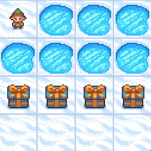

# Machine Learning 2 (CS 4052U) Take Home Exam

**Chosen Topic:** Reinforcement Learning of Practical Problems

____________________

# Utilizing Q-Learning in Gymnasium: Step by Step

## Brief Gymnasium Overview
[Gymnasium](https://gymnasium.farama.org/) is a useful Python library based on [OpenAI's Gym library](https://github.com/openai/gym?tab=readme-ov-file). This library provides a variety of environments for training and testing reinforcement learning algorithms. You control an agent by choosing from different actions, influencing what state the agent ends up in next. Each environment in Gymnasium provides a non-zero reward (negative or positive) after each step and/or upon reaching the desired end goal. These rewards help reinforcement learning algorithms determine the effectiveness of actions taken in a given state, allowing adjustments in future episodes to determine the best possible action for each state. The environments offer various options that can increase the complexity of finding optimal solutions.

## The Frozen Lake Environment
For the purpose of testing Q-Learning in a relatively simple environment, I will be utilizing the [Frozen Lake](https://gymnasium.farama.org/environments/toy_text/frozen_lake/) environment. The goal of Frozen Lake is to cross a frozen lake from the starting point to the goal without falling into any holes. Frozen Lake comes in both a 4x4 and 8x8 environment, for this guide I will be using the 8x8 environment to make the challenge slightly more complex, and gather more insights in the process.


### Understanding and Traversing the Environment
||||
|------------|---------|------------|
|Action Space|Discrete(4)|0: Move left, 1: Move down, 2: Move right, 3: Move up|
|Observation Space|Discrete(64)|0-63 (Position calculation: current_row *ncols + current_col)


</br>
In the above image we can see that the observation space is represented as integers from 0-63 where 0 is the starting position (top left) and 63 is the goal position (bottom right). You can calculate a position as the `current_row * ncols + current_col`. As mentioned in the table, the agent can take 1 of 4 actions:
- 0: Move left
- 1: Move down
- 2: Move right
- 3: Move up
  
In this example, taking action 1 (move down) moves the agent to position 17 (unless `is_slippery` is enabled, while is explained below).


#### is_slippery
When creating the environment, `is_slippery` can be set to True or False. If disabled, you will always move in your intended direction. If enabled, you will only move in your intended direction 1/3 of the time, otherwise, you have an equal 1/3 chance of slipping in either perpendicular direction. For example:
</br>
is_slippery=False             |  is_slippery=True
:-------------------------:|:-------------------------:
  |  

When taking action 2 (go right), the `is_slippery` setting determines movement probabilities. If disabled, you always move right. If enabled, you move right with only a 1/3 probability, and there's an equal chance of moving in either perpendicular direction. In this case you could go up or down as well. 
<br/><br/>
**Enabling is_slippery increases complexity. Instead of simply finding the shortest path to the goal, you must now find the path that maximizes your chances of reaching the goal without falling into a hole.** In some other environments, a shorter but riskier path might be preferable, if longer paths incur negative rewards / penalties. However, as we'll see, Frozen Lake uses a simple reward structure.

#### Rewards and Endings
The rewards structure for Frozen Lake is very simple. You are only rewarded for eventually reaching the goal. There is no penalty for taking too many actions, except for a time limit.

|Reached|Reward|
|---------|-----------|
|Goal|+1|
|Hole|0|
|Frozen|0|

**Possible Endings:**
- Goal Reached
- Player moves into a hole
- Length of episode (actions taken) reach 200 (100 if using 4x4 environment)

While there is technically no negative reward, reaching the episode limit or falling into a hole is undesirable as we will not get a reward for that episode, and we will be unable to tell if the actions we took in that episode were in the "right direction" up to a certain point as we receive no positive feedback for partial progress.

## Setup
### Libraries / Imports
We will need a few libraries in order to:
- Use Gymnasium
- Debug / Monitor Performance of our Q-Learning Algorithm

These can be imported as:
```python
import gymnasium as gym
import numpy as np
import time
import math
from matplotlib import pyplot as plt
```
### Initializing the Environment
The Frozen Lake environment can be initalized with the `gym.make('FrozenLake-v1')` command. There are various arguments that can be used to customize the environment.

#### map_name
The `map_name` argument allows us to specify the map size, either `4x4` or `8x8`. In our examples, we will be using 8x8.
```python
gym.make('FrozenLake-v1', map_name="8x8")
```

gym.make('FrozenLake-v1', map_name="8x8")|gym.make('FrozenLake-v1', map_name="4x4")
:-------------------------:|:-------------------------:
  |  

#### desc
The `desc` argument can be used to customize the map.
|Letter|Tile|
|---------|-----------|
|S|Start tile|
|G|Goal tile|
|F|Frozen tile|
|H|Tile With a Hole|

The `desc` argument is written in the following format (for 4x4): `desc=["SFFF", "FHFH", "FFFH", "HFFG"]`.

For example, `env = gym.make("FrozenLake-v1", map_name="4x4", render_mode="human", desc=["SHHH", "HHHH", "GGGG", "FFFF"])` will create the following environment:
</br>

</br>
Additionally, the generate_random_map function can be imported and used to generate a random map of any size.
```python
from gymnasium.envs.toy_text.frozen_lake import generate_random_map
env = gym.make("FrozenLake-v1", desc=generate_random_map(size=12), render_mode="human")
```
The above code generated this 12x12 environment:


#### render_mode
To help visualize what is going on the environment, there are various render options. By default, `render_mode` is set to None as it would not make sense to visually print tens of thousands, or even millions of episodes.

|render_mode|Description|
|---------|-----------|
|None|No render is computed **(Default)**|
|human|Continuous rendering in the current display / terminal. The images shown earlier in this guide are all from the human render_mode.|
|rgb_array|Not used in this guide, more info: https://gymnasium.farama.org/api/env/#gymnasium.Env.render|
|ansi|Not used in this guide, more info: https://gymnasium.farama.org/api/env/#gymnasium.Env.render|
|rgb_array_list|Not used in this guide, more info: https://gymnasium.farama.org/api/env/#gymnasium.Env.render|

**For now, we will create a function `run_episodes` to allow us to run a specified number of episodes in an environment, gather the results, and specify variables in our Q-Learning algorithm.** The paramaters of this function will be explained as the guide continues.

```python
def run_episodes(episodes, learning_rate=0.05, discount_factor=0.95, epsilon=1, epsilon_change=0.01, slippery=True, render=None, debug=False):
    env = gym.make("FrozenLake-v1", map_name="8x8", is_slippery=slippery, render_mode=render)
```

## Keeping Track of Results
We will create some NumPy arrays to help track results so we can see the effectiveness of our implementation.
```python
# 64 states (0 to 63) and 4 actions (0 = left, 1 = down, 2 = right, 3 = up)
    q = np.zeros((env.observation_space.n, env.action_space.n)) # q-value storage
    rng = np.random.default_rng() # random number from 0 to 1 (to determine if random action should be taken)
    completions = np.full(episodes,False)
    ep_lengths = np.zeros(episodes)
    ep_epsilons = np.zeros(episodes)
    checkpoints = math.floor(episodes/10) # Print statement at 10% completion intervals
```

|Variable|Used For|
|----------|--------------------------|
|q|Used for q-value storage, this starts off as an array of 0's of size 64x4. This allows us to store a Q-Value for every combination of position and action.|
|rng|Generator used to choose a number between 0 and 1. If the random number generated is lower than our `epsilon` value, we will take a random action. Otherwise, we will take the best action as determined by our Q-Values.
|completions|An array with an entry for each episode we run, it starts off as `False`. If we reach the goal in an episode, the value at the index for the current episode will be changed to `True`.|
|ep_lengths|An array with an entry for each episode we run, it starts off with 0 values, when an episode completes, we will update the value at the index for the current episode with the amount of actions taken that episode.|
|ep_epsilons|We will be using a decaying epsilon value (to be discussed later in the guide). This array has an entry for each episode, which will be updated with the epsilon value for each individual episode.|
|checkpoints|Just for tracking the progress of running episodes. This calculates how many episodes it takes to reach 10% of episodes completed. We will print out some basic statistics at each 10% checkpoint.|

## Q-Learning Implementation
### Results


## Full Code

## Resources Used
- AI (CSCI 4610U) Lectures: Winter 2024 Semester
- ML2 (CSCI 4052U) Lectures: Fall 2024 Semester
- https://www.youtube.com/watch?v=ZhoIgo3qqLU - FrozenLake Gymnasium
- https://gymnasium.farama.org/environments/toy_text/frozen_lake/